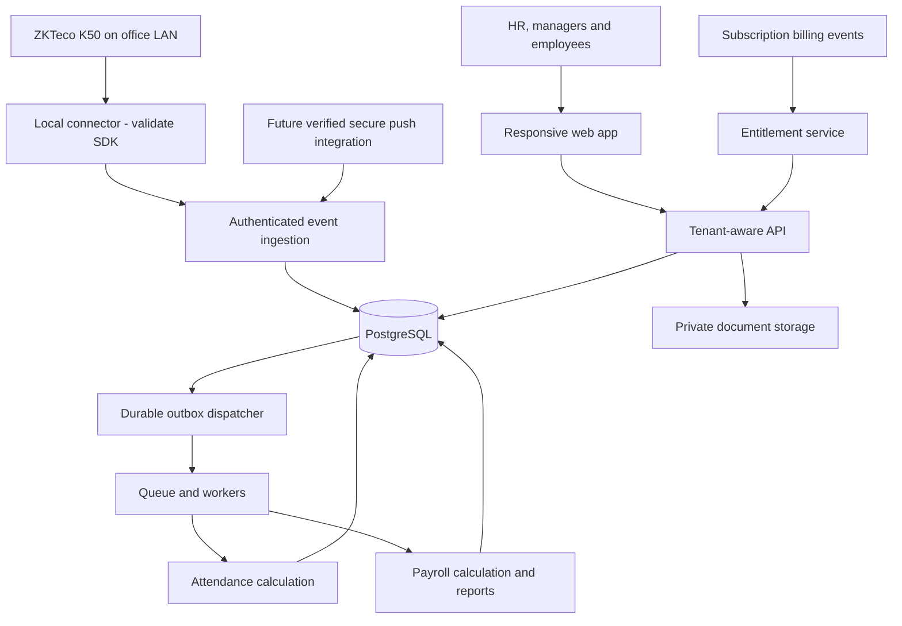

# HR management SaaS — product blueprint

Draft for discussion · 27 August 2026

Implementation follow-up · 28 August 2026: the [implementation roadmap and phase specifications](docs/implementation/README.md) define the execution baseline, work packages, contracts and release gates. This blueprint remains product context; the implementation package supplies more precise scope and explicitly bounds Phase 5 to expenses/assets. No implementation or production acceptance is claimed by the documents.

This is a proposed product and architecture, not an implementation specification or a validated business forecast. Timelines are planning estimates. Confirmed by the product owner: Pakistan is the initial market and ZKTeco K50 is the first biometric device target. Staffing, budget, prices, exact device firmware/SDK compatibility, and applicable employer-specific payroll rules remain to be confirmed.

## 1. Recommended direction

Build a cloud SaaS for small and medium businesses, initially around 10–200 employees, with employee records, leave, attendance, and payroll as one connected workflow. Provide a local attendance connector when a client's devices cannot communicate securely with the cloud. Add dedicated cloud installations for larger customers later; offer on-premises deployment only when contracts justify its operating cost.

The first product promise should be: **turn device attendance and approved leave into understandable, reviewable payroll, without spreadsheet reconciliation.**

Confirmed launch country: Pakistan. Confirmed initial device target: ZKTeco K50 (support is planned, not yet hardware-verified). Provisional starting segment: businesses with one or a few branches and regular monthly payroll. Avoid launching across countries or across office, factory, retail, and field-service workflows simultaneously.

Proposed Pakistan launch defaults: PKR payroll and subscription pricing, Asia/Karachi for local attendance interpretation, and an English-first interface with localization-ready text. Store event instants in UTC while retaining source timestamps/timezones. Record employer province/territory and applicable payroll-rule profile; do not assume every employer follows one universal rule set. Country-specific payroll, current effective rules, and opening year-to-date balances must be validated before production. Urdu, other currencies, and additional countries are later scope unless pilot demand changes this decision. Pakistan as a customer market does not by itself confirm the seller's legal registration or payment-provider eligibility.

Resourceinn's published product scope includes records, attendance, leave, shifts, payroll, recruitment, and performance. That establishes a useful reference for breadth, but its marketing claims are not independent verification of device compatibility or payroll correctness. [Resourceinn product overview](https://resourceinn.com/)

Our proposed differentiation: dependable device synchronization, transparent salary calculations, easy migration, responsive local onboarding, and straightforward subscriptions. Validate these with prospects before investing in broad feature parity.

## 2. SaaS versus local deployment

### Default: shared cloud SaaS

Clients use a browser. You operate updates, security, backups, and support centrally. This fits recurring subscriptions and keeps clients on a common product version. It also makes you responsible for availability, data isolation, incident response, and recurring infrastructure costs. Clients need connectivity for normal HR and payroll work.

### Local attendance connector

A small service runs on a supported office PC or gateway and communicates with devices over the local network. It queues captured events and uploads them using outbound authenticated HTTPS. This is a component of the SaaS, not a second HR application.

Offline capture works only while the device or connector has power, storage capacity, and appropriate local connectivity. It does not make the cloud payroll interface available offline. Publish tested retention and outage limits; alert before buffers fill.

### Later: dedicated cloud deployment

Offer a separate database or deployment in an agreed region for customers with isolation or procurement requirements. Charge a setup fee and a recurring minimum covering the additional operations. Use the same product and release pipeline, not a customer-specific fork.

### Later and exceptional: on-premises

Useful when a customer's security policy or disconnected operation requires it. The tradeoffs are installation work, restricted remote support, client infrastructure failures, update delays, more release combinations, and harder licensing enforcement.

Use an annual license with separately defined installation, maintenance, backup, upgrade, and support responsibilities. A one-time sale with unlimited lifetime support is a poor default. Containers improve portability but do not eliminate these costs.

**Decision proposed:** shared SaaS first, optional connector, dedicated cloud second, on-premises only against demonstrated demand.

## 3. Users, organizations, and access

Keep these concepts separate:

- **Tenant:** a customer account and security boundary, such as ABC Ltd.
- **Legal entity:** an employer that owns employment and payroll obligations. One per tenant initially; multiple later.
- **Branch:** an operational location, not automatically a separate tenant.
- **Employee:** a worker record, even if the person never logs in.
- **User:** a login identity that can have membership in one or more tenants.
- **Role:** permitted actions and data scope within a tenant.
- **Subscription:** the commercial agreement and billing status.
- **Entitlements:** enabled modules and allowed capacity.

Initial roles: company owner, HR administrator, payroll administrator, payroll approver, team manager, employee, and read-only auditor. One person can hold more than one role when policy permits.

An employee sees their own payslips and requests. A manager sees their team's attendance but does not automatically see salaries. HR record administration does not automatically permit payroll release. The platform operator manages subscriptions without routinely browsing employee or salary data. Any support access should be explicitly authorized, time limited, and logged.

## 4. Product modules

### A. Employee management — launch essential

- Employee number, profile, contact details, emergency contact, employment status, joining and leaving dates.
- Department, designation, branch, manager, employment type, and work schedule.
- Contracts and documents with access control, expiry reminders, and controlled downloads.
- Effective-dated employment and compensation history: a future salary increase must not overwrite the rate used in a previous payroll.
- CSV import with preview, validation, duplicate handling, and import results.
- Employee directory; basic search and filters.
- Simple onboarding and offboarding checklists, including access revocation and final-pay tasks.
- Optional identity and bank details only where needed, with tighter access than directory information.

### B. Attendance and shifts — launch essential

- Raw biometric punches plus manual/CSV fallback.
- Device enrollment, branch assignment, employee mapping, sync health, last-seen status, and failure alerts.
- Fixed shifts, grace periods, breaks, holidays, weekly rest days, and overnight shifts.
- Late arrival, early departure, missing punches, absence, and overtime calculations.
- Attendance correction requests and manager approvals.
- Daily and monthly attendance views, exception queues, and a payroll cutoff/lock.
- Configurable rules with effective dates; retain the policy version used for a calculation.

Start with the ZKTeco K50 and a verified firmware/variant list. Treat K50 Pro and other similarly named devices as separate compatibility targets until tested. Rotating rosters, split shifts, multiple simultaneous jobs, and field attendance can substantially expand scope; sequence them after pilot needs are known.

### C. Leave management — launch essential

- Leave types, eligibility, balances, accrual, paid/unpaid classification, and holidays.
- Full-day and half-day requests; hourly leave only if the first segment needs it.
- Approval routing, cancellation, balance adjustments with reasons, and team calendar.
- Defined carry-forward, expiry, probation, and negative-balance behavior.
- Approved leave integration with attendance and payroll.

Leave cannot be postponed if payroll deductions depend on attendance.

### D. Payroll — essential before selling the complete product

- Pay periods and effective-dated salary structures.
- Basic salary, recurring allowances, overtime, bonuses, reimbursements, and authorized deductions.
- Unpaid leave, joining/leaving proration, salary changes, arrears, and advances or loans if pilot employers require them.
- Explicit currency, rounding policy, and decimal arithmetic; no binary floating-point calculations for money.
- Country-specific statutory rules with effective dates and documented applicability, reviewed by a qualified local payroll specialist.
- Preview, exception validation, comparison with the previous period, approval, finalization, and payslips.
- Payroll register, bank-file or CSV export, accounting summary, and manual payment-status reconciliation.
- Final settlement for departures within a documented supported scope.
- Explainable line items: amount, formula, inputs, rate, dates, and rule version.

Workflow: **draft → calculated → reviewed → approved → finalized → exported/payment recorded**. Exporting a bank file is not proof that salary was paid.

Freeze finalized calculations and their inputs. Corrections use an authorized reversal or adjustment with an audit trail; do not silently rewrite previously issued payslips. A late device event after payroll close raises an exception rather than silently changing net pay.

Do not execute arbitrary customer JavaScript or SQL as payroll formulas. Start with typed components and constrained formulas. Capture opening year-to-date figures when a client migrates mid-year.

For Pakistan, validate income-tax withholding and any applicable EOBI, provincial social-security, provident-fund, gratuity, or other rules for the particular employer. This blueprint makes no claim that every item applies or specifies current rates. Use effective legislation, official sources, and specialist sign-off; a search result for an older tax year is not sufficient. [FBR income-tax source collection](https://www.fbr.gov.pk/Categ/Income-Tax-Ordinance/326/1000)

### E. Employee self-service — launch essential

Responsive browser access to personal attendance, leave balance, requests, profile-change requests, and payslips. Managers get team approvals. Begin with a mobile-friendly web application; add native mobile apps only for confirmed requirements.

Avoid caching sensitive payroll pages for offline use by default. Web attendance, GPS, and geofencing are optional later policies, not proof that the person actually performed work.

### F. Reports and notifications — launch essential

Headcount, joiners/leavers, attendance exceptions, absence, leave balances, overtime, payroll register, deductions, and department costs. Restrict report columns and exports by role. Include audit history and device health. Use in-app and email notifications initially, without sensitive salary details in notification bodies.

### G. Platform administration — launch essential

Customer provisioning, invitations, plan assignment, complimentary access, billing ledger, employee/device limits, suspension and reactivation, renewal reminders, audit events, usage visibility, imports, and customer export/offboarding tools.

Separate platform administration from a customer's HR workspace.

### H. Expansion after the core is reliable

Prioritize expenses, asset custody and returns, richer onboarding, letters, accounting integrations, advanced shifts, multiple legal entities, and native mobile attendance according to demand. Recruitment/ATS, appraisals, performance goals, training, benefits administration, and workforce planning come later.

AI can eventually assist with document search or drafting, under permissions and human review. It should not decide salary deductions, candidate rejection, performance scores, or disciplinary actions in the initial product.

## 5. Biometric integration design

### First implementation target: ZKTeco K50

The vendor's regional K50 page lists TCP/IP and USB-host communication. This supports planning a local-network integration, but does not verify the SDK, polling behavior, direct cloud push, or secure HTTPS support on the customer's particular unit. [ZKTeco K50 product specifications](https://www.zkteco.eg/KSeries/K50)

Recommended initial path, subject to the hardware proof of concept: **K50 → office LAN → local connector → authenticated outbound HTTPS → SaaS attendance ingestion**. Do not promise direct ADMS/cloud push based on the model name. Do not require customers to expose device ports publicly.

The connector should run as a background service that starts with its host, maintains an encrypted durable event backlog, exposes sync health, and resumes after outages. A Windows service is a candidate if the validated vendor SDK requires Windows; confirm the OS and SDK before committing. Evaluate a modest configurable polling interval on real hardware rather than promising instantaneous updates. Fingerprint enrollment remains on the device initially; the SaaS maps device user IDs to employee records and receives attendance metadata, not fingerprint templates.

First test checklist: obtain the exact model/firmware and communication settings; identify any existing software using the device; confirm authorized SDK/API access and redistribution terms; read a small approved attendance sample; map employee IDs; repeat the read to verify deduplication; test lost connectivity and host/device restart; and reconcile replayed events. Confirm USB export format before treating it as an import fallback. Never clear device logs, change firmware, or disrupt existing attendance collection as part of a read-only integration trial.

An office PC or gateway must be available for regular connector operation. If it is off, synchronization pauses; recovery depends on events retained by the device and connector. Verify the actual unit's storage limits and buffer-full behavior rather than relying on another K50 variant's capacity claim.

### Extensible integration paths

Support three paths behind one normalized event interface:

1. **Verified secure direct push:** compatible devices or official vendor middleware send events to your ingestion endpoint. Verify protocol, authentication, TLS, firmware, and licensing before accepting a model.
2. **Local connector:** polls a documented vendor SDK/API or receives local push, stores an encrypted durable backlog, and uploads through an authenticated outbound connection. Necessary for many devices without a suitable secure cloud path.
3. **CSV import:** controlled fallback and migration path, with source metadata and duplicate handling.

ZKTeco publishes a PUSH SDK, but that does not establish support for every ZKTeco model, secure direct HTTPS, or unrestricted SDK redistribution. Obtain the exact documentation and terms. [ZKTeco PUSH SDK](https://www.zkteco.com/en/PUSHSDK)

Do not expose device management ports to the public internet. If a device only offers an insecure protocol, keep it on an isolated local network behind the connector. A device serial number alone is not authentication.

Store raw events separately from derived attendance. Each event should retain tenant, branch/device identity, original device user ID, mapped employee, original timestamp, interpreted UTC time and source timezone, server receive time, event type where supplied, original payload reference, and ingestion status. Scope device-user mappings by tenant and device, with validity dates when identifiers are reused.

Devices may omit a direction or return an incorrect clock. Do not assume every first punch is a check-in and every last punch is a checkout without an explicit shift policy. Handle duplicates, out-of-order events, repeated identical timestamps, clock drift, overnight dates, missing punches, and unrecognized employees.

Use at-least-once delivery with idempotent ingestion. Persist accepted events before acknowledging delivery. Deduplicate with a real event identifier where available or a tested composite key; timestamp-only deduplication is unsafe. Maintain retry/backoff, replay checkpoints, backlog monitoring, and quarantine for malformed events. Avoid deleting device history as part of ordinary synchronization.

Keep biometric templates and face images off the SaaS by default. Configure collection so only necessary attendance metadata is ingested; filter unexpected sensitive payloads before logging or storage. Device matching should remain in the device/vendor system wherever possible. Privacy and retention obligations still apply to attendance data.

Device proof-of-concept gate: real hardware, exact firmware recorded, secure provisioning demonstrated, network interruption and restart tested, backlog replay reconciled, and no lost or duplicated derived attendance in the test corpus.

## 6. Recommended technology choices

No language is mandatory. The team's proven skills should outweigh small framework preferences.

### Default for a new team

- **Frontend:** TypeScript, React, and Next.js; a consistent accessible component library with responsive forms and tables. Next.js has built-in TypeScript support. [Next.js TypeScript documentation](https://nextjs.org/docs/app/api-reference/config/typescript)
- **Backend:** TypeScript on Node.js with NestJS. Keep payroll and attendance domain rules in backend modules, not duplicated in browser code or scattered frontend server actions.
- **Database:** PostgreSQL for relational records, constraints, transactions, reporting, and numeric money fields.
- **Database access:** a typed query/ORM layer such as Prisma, plus reviewed SQL migrations for database-specific constraints and row security. Prove tenant context and transaction behavior before standardizing the access layer.
- **Background processing:** BullMQ and a supported Redis deployment, with separate workers for imports, notifications, device normalization, reports, and payroll calculation. NestJS documents this integration. The database remains the authoritative record; use a transactional outbox or equivalent durable dispatch mechanism for critical jobs. [NestJS queues](https://docs.nestjs.com/techniques/queues)
- **File storage:** private S3-compatible object storage, with expiring authorized downloads and scanning of uploaded files.
- **Authentication:** a maintained identity solution supporting invitations, MFA, secure recovery, and eventual SSO. Choose the provider after region, cost, and on-premises needs are known; keep business roles inside the application.
- **Connector:** decide after the hardware spike. C#/.NET is a candidate when the supported SDK is Windows-native; a cross-platform service is possible when the SDK permits it. Do not force TypeScript onto a vendor integration it cannot support reliably.
- **Deployment:** containerized web/API/worker services, managed PostgreSQL and backups, managed secrets, TLS, and separate development/staging/production environments.
- **Verification:** domain unit tests, database integration tests, tenant-isolation tests, API tests, browser journey tests, and hardware replay tests in CI.

This gives a mostly shared language across the web product and a clear boundary around hardware-specific code. Start as a **modular monolith**: one backend codebase with well-separated modules and separately scalable workers. Avoid microservices and Kubernetes until measured operating needs justify them.

### Credible alternatives

An experienced C# team can choose ASP.NET Core with React and PostgreSQL; a Python team can choose Django with React and PostgreSQL; an experienced PHP team can choose Laravel. Each requires the same payroll, security, and hardware validation. Python need not be added solely for arithmetic, and a Windows device SDK need not force the entire SaaS backend onto Windows.

Start with one hosting region selected for customer requirements, latency, and approved data location. A managed platform can reduce early operating effort; a major-cloud deployment can add control as needs mature. Select specific vendors and versions during the technical spike, not from an uncosted list. Check dependency and device-SDK licenses before commercial distribution.

## 7. Architecture and data boundaries

Tenant-owned tables carry `tenant_id`. Resolve tenant context from an authenticated membership or provisioned connector identity, not from a request field alone. Use tenant-aware unique keys and foreign keys to prevent cross-tenant relationships, including during imports and background jobs.

Recommended starting isolation: shared PostgreSQL with application scoping plus row-level security as defense in depth. Runtime roles must not be superusers, table owners, or have `BYPASSRLS`; use a separate migration role. Test transactions and pooled connections for tenant-context leakage. PostgreSQL explicitly documents owner and privileged-role bypass behavior. [PostgreSQL row security](https://www.postgresql.org/docs/current/ddl-rowsecurity.html)

Scope object-storage keys, cache entries, queues, generated reports, search, signed download authorization, logs, and exports as carefully as database rows. Verify worker entitlements when jobs execute, not only when queued. A separate database per enterprise customer can be offered later, but does not remove application authorization requirements.

Core entity groups:

- Platform: tenants, users, memberships, roles, permissions, plans, plan versions, subscriptions, invoices, payments, entitlements, override history.
- Organization: legal entities, branches, departments, employment records, reporting relationships, documents.
- Time: devices, connectors, employee-device mappings, raw events, shifts, assignments, policies, attendance summaries, corrections, leave policies, leave ledger, requests, approvals.
- Payroll: periods, salary-component definitions, compensation history, rule versions, runs, immutable run inputs, line items, approvals, payslips, adjustments, exports, payment records.
- Operations: notifications, audit records, durable outbox, import/export jobs, retention settings.

Use an employee lifecycle and effective-dated history rather than deleting an employee to remove their access or reduce capacity usage.

## 8. Licensing and complimentary customers

For SaaS, the server enforces access. Desktop-style product keys are unnecessary. A browser flag or hidden menu is never an authorization boundary.

Every protected operation checks authenticated identity, tenant membership, role/data scope, tenant status, relevant entitlement, and capacity where applicable. Imports, APIs, workers, and device paths must obey the same policies.

Represent commercial status separately from capability:

- Plan and immutable plan version: defines baseline modules and limits.
- Billing mode: free, paid subscription, complimentary, or manually invoiced contract.
- Entitlements: employee, branch and device capacities; modules; support package.
- Overrides: scoped feature/capacity changes, reason, approving operator, start, optional end, and audit history.
- Subscription lifecycle: trial, active, past due, grace, restricted, cancelled. Tenant security suspension is a separate control that a complimentary grant cannot bypass.

Example: Customer A has the Business capability package with a 100-employee capacity and a complimentary billing mode. No payment is collected; normal role and tenant restrictions still apply. Customer B uses the same Business package with monthly billing. Never identify special clients by hardcoded name or email domain.

Plan changes and grants must be audited and restricted to platform operators. Show an override preview before saving. Use date-effective records so a later price or plan change does not silently alter existing contracts. Permanent complimentary access can have no expiry, but still have a review date and explicit support limits.

Later on-premises licensing: signed licenses containing customer/installation ID, edition, limits, validity, and renewal/grace terms; public-key verification; online renewal or an agreed offline renewal process. Never ship the signing private key. Fully offline licenses cannot reliably guarantee immediate revocation or defeat a determined administrator controlling the host. Combine reasonable technical controls with a commercial agreement.

## 9. Subscription packaging

Initial packaging hypothesis, with prices deliberately undecided:

- **Free — up to 5 active employees:** records, simple leave, manual/CSV attendance, employee access, basic reports and export. No assisted device installation. Basic payroll can be evaluated later; statutory maintenance and support make it costly to promise at zero price.
- **Starter — up to 20:** covers the 6–20 employee range, including 10-person companies; core HR, leave, standard attendance and single-country payroll. One branch and one supported device proposed.
- **Growth — up to 50:** same reliable core plus multiple branches, more devices, approval flexibility, and richer exports. Define exact limits before publication.
- **Business — up to 100:** more capacity, advanced permissions and workflows, and a defined support service. Do not make essential security an upgrade-only feature.
- **Scale/Enterprise — 101–250 and larger contracts:** capacity packs or per-employee billing; optional SSO, dedicated cloud, integrations, and negotiated support.

Do not create a new product edition for every headcount. Keep internal capability packages separate from employee-capacity bands even if the initial public pricing page bundles them. This also allows a small company to buy advanced features without pretending it has 100 employees.

Simple launch pricing is fixed monthly capacity bands. A later alternative is a platform minimum plus a charge per active employee with volume discounts. The latter smooths the price jump from 20 to 21 employees but requires a precise usage policy.

Define an active employee consistently, including workers without login accounts. Archived employees remain available under retention rules and do not consume current capacity; dated employment and payroll history remain intact. Imports and simultaneous employee activations must enforce limits atomically. Do not allow archive/recreate cycles to erase an employee's current-period payroll history or evade period usage rules.

For launch, purchased capacity controls simultaneous active employees. Historical pay for legitimate leavers does not require deleting data or buying another current seat. If a per-employee billing model is introduced, define billable employee-days or period participants separately and disclose it; do not silently switch definitions.

Show usage and a warning before the cap. Block new activations over the cap or offer an explicit upgrade; never discard attendance or delete existing employees. Apply upgrades immediately only after consent; apply downgrades at renewal when capacity fits. Preserve historical payroll and downloads when a feature is removed.

Charge separately for hardware, installation, on-site visits, substantial data cleanup, custom integrations, and extra messaging. Validate whether device integration is bundled or a paid add-on. Security controls, core backups, and access control belong in every plan.

Competitor observation: Zoho's pricing separates core HR from attendance and other modules, while Resourceinn advertises a free offer up to 10 users. A five-employee free tier alone is therefore not a distinctive proposition, and employee/user definitions may differ across vendors. [Zoho People pricing](https://www.zoho.com/people/zohopeople-pricing.html) · [Resourceinn attendance and free offer](https://resourceinn.com/hr-solutions/online-attendance-management-system/)

## 10. Billing and payments

Manual invoicing and verified bank-transfer reconciliation are acceptable for pilot customers. Keep invoice, payment, credit/refund, and subscription records even before automated collection exists. A manually approved payment must have an audit trail.

Automated billing requires hosted checkout, verified and idempotent webhooks, provider-state reconciliation, renewal notices, failed-payment handling, credits/refunds, and local invoice/tax requirements. Do not store card details. Do not activate paid service merely because a browser returns to a success page.

Choose a payment provider only after confirming the seller's registered country, bank settlement, supported currency, recurring billing, refund handling, and merchant onboarding. Pakistan is not listed on Stripe's supported business-country page checked for this draft, so do not assume a locally registered Pakistani business can directly onboard. Selling to Pakistani customers and being eligible as a Pakistani merchant are different questions. [Stripe availability](https://stripe.com/global)

Proposed past-due policy: reminders and a published grace window; maintain capture/replay within defined limits during grace; after that restrict new processing while preserving authorized read/export access for a published retention period. Explain connector backlogs and retention limits before service stops. Avoid a surprise lockout on payday; do not promise indefinite free storage or operation.

Monthly plans are the starting point. Annual prepayment, discounts, trials, and reseller pricing should follow initial willingness-to-pay evidence.

## 11. Security, privacy, reliability, and contracts

Before production payroll:

- MFA for privileged users; secure sessions, recovery, invitation expiry, and revocation.
- Tenant and role tests across API, storage, reporting, imports, and background jobs.
- Encryption in transit and at rest, managed secrets, private database networking, and least-privilege accounts.
- Restricted and logged access to identity numbers, bank details, salary history, and documents; avoid sensitive data in logs and monitoring.
- Append-only application audit events with tightly controlled modification rights and suitable retention. Do not market them as tamper-proof without stronger evidence and controls.
- Upload size/type checks, malware scanning, export safety, and expiring download links.
- Monitored backups and an exercised recovery procedure, including a strategy to export or recover one tenant without exposing another.
- Incident response ownership, operational alerts, dependency updates, rollback procedures, and tested schema migrations.
- Contracts covering permitted use, service/support scope, data ownership, export, retention/deletion, hosting location, subprocessors, and responsibilities. Obtain appropriate legal review rather than treating a license key as legal protection.

Define recovery-point, recovery-time, and service-level targets after infrastructure and support costs are known. Do not publish numbers the team has not demonstrated. Sensitive HR and biometric-related information needs a jurisdiction-specific privacy review, even if raw biometric templates are never uploaded.

## 12. Delivery phases and acceptance gates

Durations below are rough elapsed estimates assuming two experienced full-time engineers, part-time design/QA, access to real devices, and an available HR/payroll specialist. They exclude prolonged procurement, payment-provider onboarding, legal review, and recruitment. A solo developer or broader payroll scope will take longer. Some tasks can overlap, but acceptance gates should not be skipped.

### Phase 0 — discovery and technical validation · 2–3 weeks

Interview 5–10 target companies in Pakistan and choose the initial industry and province/territory scope. Collect anonymized policies, attendance files, payroll examples, the actual K50's firmware/variant details, and migration data. Validate K50 log retrieval and the hardest supported Pakistani payroll cases. Sketch the principal journeys and confirm the payment-provider route.

**Gate:** 2–3 willing pilot companies, a supported-device proof of concept, agreed country/payroll scope, and a costed backlog with exclusions. No customer data enters a prototype without authorization and appropriate handling.

### Phase 1 — platform and people · 3–5 weeks

Tenant provisioning, authentication, permissions, organization structure, employee lifecycle, document access, CSV import/export, audit history, plan/entitlement foundation, and complimentary access. Include initial operator controls, deployment pipeline, backups, and baseline monitoring.

**Gate:** two test tenants remain isolated across UI, APIs, files, and imports; employee migration and restore exercise pass; free and paid capabilities are enforced on the server.

### Phase 2 — attendance and leave · 4–6 weeks

Supported device integration, connector provisioning and update path if needed, raw-event storage, shift rules, leave ledger, corrections, approvals, exception reports, employee access, and payroll-period lock.

**Gate:** pilot attendance reconciles against approved source records; overnight shifts, duplicate delivery, outages, restart, and employee mapping cases pass. Clients know exactly which models are supported.

### Phase 3 — payroll pilot · 4–6 weeks

Supported salary structures, country rules, opening balances, calculations, exceptions, approval/finalization, payslips, bank exports, adjustments, and final settlement within the agreed scope. Continue shadow calculations using historical and live pilot inputs.

**Gate:** all differences against independently approved payroll expectations are explained and resolved; a payroll specialist signs off the supported rules. This is not yet unrestricted public payroll launch.

### Phase 4 — commercial release and hardening · 3–5 engineering weeks

Finish renewal and upgrade/downgrade flows, manual or verified automated collections, grace policies, operator support tools, security/load/recovery testing, documentation, onboarding, and monitoring. Run production-readiness review and recruit launch customers.

**Gate:** two consecutive live payroll cycles pass in parallel with the existing process, with every difference reconciled and client approval recorded; cross-tenant tests and restore drills pass; support and rollback responsibilities are assigned. Historical replay speeds feedback but does not replace live cycles.

Phases 0–4 total **16–25 engineering-calendar weeks if sequential**. Live monthly payroll cycles or external dependencies can push commercial readiness later; this is an estimate, not a promised launch date. A controlled attendance-only pilot can begin earlier with clear scope and no claim of complete payroll readiness.

### Phase 5 — expansion · after retention and support are stable

Choose the next module from actual demand: expenses, assets, advanced rosters, additional devices, accounting, performance, recruitment, native mobile, or dedicated hosting. Add a second country only after funding the compliance and support ownership it requires.

## 13. Release test scenarios

Use independently reviewed expected results, not only expectations copied from the implementation:

- Cross-tenant guessed identifiers, export URLs, uploads, worker jobs, cache keys, and pooled connections.
- A manager attempts to see salaries; an employee tries to retrieve another employee's payslip.
- Duplicated and out-of-order punches, missing checkout, clock drift, overnight shifts, multiple devices, and employee-ID reuse.
- Connector/device restart, cloud outage, buffer pressure, and safe replay after recovery.
- Leave cancellation after approval, holiday overlap, half day, unpaid absence, and corrections after cutoff.
- Mid-month joiner/leaver, salary increase, arrears, bonus, rounding, negative net pay, and applicable rule changes.
- Repeated payroll calculation, worker crash, duplicate approval, duplicate bank export, and adjustments to a finalized period.
- Concurrent employee imports at the plan cap; complimentary-grant expiry; upgrade, downgrade, webhook replay, failed collection, and reactivation.
- Restore from backup and tenant export without disclosure of unrelated customers.

## 14. Business validation and operating cost

Validate prices with customers after showing their actual workflow. Avoid guessing a currency price before geography and support expectations are clear.

Costs include managed infrastructure, database backups, storage, email/SMS, monitoring, payment fees, support time, payroll-rule maintenance, device testing, onboarding, accounting/legal work, and incident coverage. Hardware support can dominate early cost even when cloud hosting is inexpensive.

For each plan, estimate monthly revenue minus attributable hosting, payment, support, and maintenance costs. Also account for shared engineering/operations costs and customer-acquisition expense. Track onboarding effort separately so installation fees can cover it. A free plan still needs abuse limits and a sustainable support policy.

Measure time to first employee import, time to first device sync, unresolved attendance exceptions, payroll reconciliation differences, time to close payroll, paying-customer conversion, churn/retention, and support minutes per tenant. Define revenue metrics so complimentary accounts are not counted as paying recurring revenue.

Potential go-to-market: a small set of direct pilot companies, referrals from payroll/accounting firms, and biometric resellers with clear installation responsibilities. Validate partner incentives and device support before committing to a reseller program. Copying a competitor's branding, interface, or proprietary assets is outside the product plan.

## 15. Decisions to resolve next

1. Pakistan is confirmed; identify the first employers' provinces/territories and applicable payroll obligations.
2. First industry and typical employee/branch count.
3. ZKTeco K50 is confirmed; obtain firmware/variant details, access to a test unit, existing attendance-software details, and availability of an office PC/gateway.
4. Available development team, current skills, budget, and desired pilot date.
5. Monthly salaried workers only, or also hourly/daily wages, contractors, and complex shifts?
6. Which companies can provide pilot data, policy examples, and payroll review?
7. Seller's registered country, payment methods, and currency.
8. Which complimentary clients are intended, with what capacity and support?
9. Is on-premises a confirmed customer requirement or just an option worth considering?

## 16. Suggested immediate outcome of the next discussion

With Pakistan and ZKTeco K50 confirmed, agree the customer segment and supported payroll scope, inspect the pilot device, and validate the connector approach. Then turn this draft into an MVP feature list with explicit exclusions, a small set of user journeys, a data model, and a prioritized delivery backlog. Do not scaffold the full application before the highest-risk device and payroll assumptions are tested.
