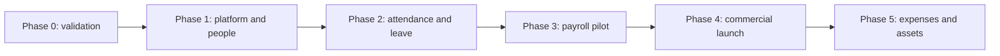

# Implementation roadmap

Version 1.1 · 28 August 2026 · Status: foundation slice implemented; phases remain incomplete

This package converts the [product blueprint](../../PRODUCT-PLAN.md) into an execution plan. It retains phases 0–5; smaller work packages inside each phase are the units of implementation. These documents specify required production behavior, not a claim that anything has been built, tested, legally approved, or deployed.

## Confirmed scope and working defaults

Confirmed: Pakistan launch; ZKTeco K50 as the initial device target; employee management, biometric attendance and payroll; multiple customer companies; free, monthly paid and selected complimentary accounts.

Working defaults: cloud SaaS with a local attendance connector; PKR; Asia/Karachi; English initially; one legal employer per tenant; multiple branches; monthly salaried employees; an initial ceiling of 250 active employees per tenant. Prices, hosting region, supported provinces/employer categories and actual K50 firmware remain decisions, not confirmed facts. An enterprise request beyond the ceiling requires a new capacity test and contract.

Version 1 production includes staff lifecycle, basic onboarding/offboarding, leave, fixed/overnight shifts, K50 event collection, corrections and approvals, validated Pakistan payroll, payslips, exports, reports, server-enforced subscriptions, complimentary access, security, backup/recovery and operating procedures.

Outside version 1: international payroll; hourly/piecework payroll; ATS/recruitment; performance scoring; native mobile applications; GPS/face recognition attendance; arbitrary payroll scripts; bank payouts; direct tax filing; multiple legal employers in one tenant; dedicated/on-premises deployment. Phase 5 adds expenses and assets only after release stability. Other expansion remains a separate approval, not an implied commitment.

## Reading order

1. [Shared system specification](SYSTEM-SPEC.md): architecture, access, API/data contracts, operating targets and definition of done. Applies to every phase.
2. [Decision and evidence register](DECISIONS.md): defaults, external dependencies, owners and approval gates.
3. [Phase 0 — validation](PHASE-00-VALIDATION.md): hardware, payroll and architecture proof points.
4. [Phase 1 — platform and people](PHASE-01-PLATFORM-PEOPLE.md): repository, authentication, tenancy, entitlements and employee management.
5. [Phase 2 — attendance and leave](PHASE-02-ATTENDANCE-LEAVE.md): K50 connector, raw events, attendance policies, leave and approvals.
6. [Phase 3 — Pakistan payroll](PHASE-03-PAKISTAN-PAYROLL.md): validated calculations, immutable runs, approvals, payslips and export.
7. [Phase 4 — commercial release](PHASE-04-COMMERCIAL-RELEASE.md): subscriptions, collection, support, hardening and pilot release.
8. [Phase 5 — expenses and assets](PHASE-05-EXPENSES-ASSETS.md): bounded post-launch expansion.

## Dependency and release sequence

The diagram is the default acceptance sequence, not a requirement to leave engineers idle. Safe preparatory work such as repository scaffolding and synthetic fixtures may proceed while external Phase 0 evidence is pending, once its architecture decisions are recorded. Do not mark Phase 0 complete, advertise K50 compatibility, enable real payroll finalization or onboard live customers by substituting mocks for missing evidence.

Billing work in Phase 4 can be developed alongside payroll after Phase 1 contracts are stable. The commercial release still requires all preceding release gates. Security and backups start in Phase 1; Phase 4 verifies and hardens them rather than introducing them for the first time.

## Phase ledger

- **P00 — in progress (partial architecture spike); 2–3 estimated weeks.** Exit: approved supported-scope record, K50 evidence, selected integration/auth/deployment approach and independent payroll fixtures. Allowed deployment: local/staging validation only.
- **P01 — in progress (foundation only); 3–5 estimated weeks.** Exit: tenant-isolated platform and employee workflows, server-side capability/capacity controls, basic recovery evidence. Allowed deployment: internal staging; no public release.
- **P02 — not started; 4–6 estimated weeks.** Exit: reconciled attendance and leave with tested real K50 recovery. Allowed deployment: expressly agreed attendance-only pilot after applicable security/privacy gates; payroll remains unavailable.
- **P03 — not started; 4–6 estimated weeks.** Exit: independently reconciled payroll engine and approved rule packages. Allowed deployment: supervised shadow payroll; existing payroll remains authoritative.
- **P04 — not started; 3–5 estimated engineering weeks.** Exit: two consecutive live payroll cycles reconciled, collection/grace behavior tested, operational/security sign-off. Allowed deployment: controlled commercial production.
- **P05 — not started; 4–6 additional estimated weeks.** Exit: expense and asset gates, phased rollout and rollback evidence. Allowed deployment: opt-in production modules.

Phases 0–4 retain the blueprint's 16–25 week sequential estimate. Assumptions: two experienced engineers, part-time design/QA, available hardware and a Pakistan payroll specialist. These are not commitments or measurements of coding-agent speed. External procurement, business approvals and live monthly cycles may extend elapsed time. Re-estimate after Phase 0; do not invent a calendar deadline from these ranges.

## How implementation should run

Each numbered work package in a phase is a small, reviewable delivery slice with matching acceptance checks. Implement in listed order unless dependencies expressly permit overlap. A slice is complete only after schema, backend behavior, UI where applicable, tests and operating notes are delivered together.

For each slice, the implementing agent must:

1. Read this index, the shared spec, decisions and the selected phase. Inspect the actual repository; do not assume planned code or commands exist.
2. Record the selected package and relevant blocked decisions. Do not change product scope or a sensitive policy silently.
3. Add the smallest required migration, behavior and interface. Preserve previous phase behavior; avoid unrelated refactors.
4. Run relevant existing checks and new acceptance tests, including negative authorization paths. Record actual commands, results, unresolved failures and evidence paths in the phase's implementation record.
5. Update documentation/status only to the level achieved: implemented, locally verified, staging verified, pilot verified or production approved. These are distinct states.
6. Stop at required human/external gates. Do not enable payments, deploy publicly, touch production biometric logs or process real payroll merely to make a test pass.

Every phase document ends with an implementation record. Complete evidence there as work happens. Do not prepopulate approvals or mark these document checklists as test results. The product owner subsequently authorized implementation and commits to `usama124/kinto-hr`; paid services, live data and public deployment remain unapproved.

## Ownership and approval

The product owner decides commercial scope, defaults and customer commitments. The engineering implementer supplies code and technical evidence. A reviewer verifies security and critical invariants. A qualified Pakistan payroll specialist approves applicable rules and expected results. The customer payroll approver signs off pilot reconciliations. The operator accepts recovery, incident and support responsibilities. One person may cover several roles only where that does not defeat required independent payroll review or separation of duties.

## Universal phase acceptance

All required work packages pass; no unexplained payroll discrepancy, cross-tenant exposure, data-loss defect or broken authorization remains. New migrations apply to a clean database and the previous release. Relevant replay/retry, permission, restore and browser journeys pass. No production secrets or personal customer data enter fixtures. Feature entitlement does not substitute for role permission. Applicable external decisions are resolved or the affected capability stays disabled and is explicitly excluded from release.

The first delivery is the safe **P00-04 / P01-01 foundation slice**, with evidence in [the foundation record](../evidence/phase-01/foundation.md). P00-01 still needs owner-approved pilot details. Next engineering work completes the foundation operating setup and P01-02 OIDC/membership authorization before employee endpoints are exposed. K50 hardware and payroll review gates remain external dependencies.
